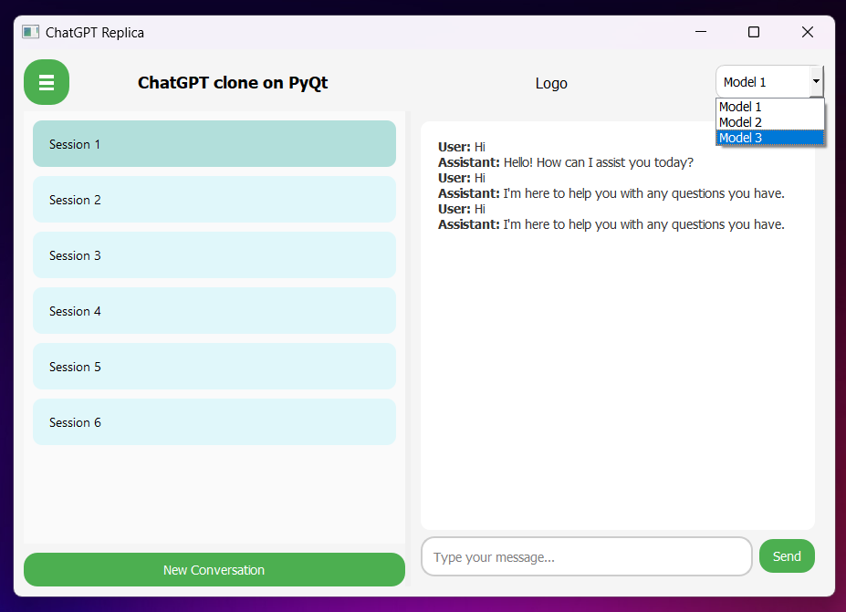

# 🤖 ChatGPT Clone with PyQt5

Welcome to the **ChatGPT Clone** project! This application is built using [PyQt5](https://riverbankcomputing.com/software/pyqt/intro) to replicate the look and feel of ChatGPT, providing a local, desktop-based chat interface.

## 🚀 Preview

### 1. Chat Interface (Upon Loading)



> 📝 **Tip**: The sidebar is **collapsible**—use the toggle button to expand or collapse the conversation list, allowing for a clean, focused chat window.

> 📝 **Tip**: You can select from **multiple models** from the dropdown available based on your needs and requirements.

> 📝 **Tip**: Create a new session by clicking New Conversations and **revisit your past conversations**!

---

## ✨ Features

- 🧠 Dynamic chat interface resembling ChatGPT
- 📂 Multiple chat sessions saved in a collapsible sidebar
- 🖥️ Responsive and user-friendly interface with a streamlined look
- 💬 Simulated streaming responses from the assistant

---

## ⚙️ How to Run Locally

### Prerequisites

1. Ensure you have [Python](https://www.python.org/downloads/) installed. 🐍
2. Install [PyQt5](https://riverbankcomputing.com/software/pyqt/intro) and other necessary dependencies.

### Setup Instructions

1. **Clone the Repository** 🛠️

   ```bash
   git clone https://github.com/harshitsingh09/ChatGPT-clone-PyQt.git
   cd ChatGPT-clone-pyqt5
   ```

2. **Create a Virtual Environment** 🌐

   ```bash
   python -m venv venv
   source venv/bin/activate  # For iOS/Linux users
   venv\Scripts\activate   # For Windows users
   ```

3. **Install Dependencies** 📦

   ```bash
   pip install -r requirements.txt
   ```

4. **Run the Application** 🏃‍♂️
   ```bash
   python main.py
   ```

---

## 🛠️ Project Structure

```bash
.
├── main.py                # Main application file
├── README.md              # Project documentation
├── requirements.txt       # Python dependencies
├── images                 # Folder containing screenshots
└── ...
```

---

## 🤝 Contributing

Contributions are welcome! If you'd like to suggest changes or improvements, feel free to open an issue or submit a pull request. 🚀

---

## 📜 License

This project is licensed under the MIT License - see the [LICENSE](LICENSE) file for details.

---

If you find this project helpful, don’t forget to give it a ⭐️! Your support is much appreciated. 😊✨
